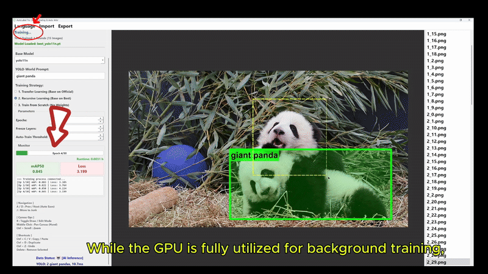

# KeenForge: Train Your Own AI Vision Model — No Code Required

[](https://www.gnu.org/licenses/agpl-3.0)
[](https://www.python.org/)
[](https://pytorch.org/)
[](https://github.com/KeenForgeAI/AutoLabel-Pro)

> **CVPR 2026 Demo Track** · Formerly AutoLabel Pro

**KeenForge** is a desktop application that lets you train your own object detection model — without writing a single line of code. Import images, draw a few boxes, and the AI trains itself in the background. Your data never leaves your computer.

<p align="center">
  
</p>

---

## Why KeenForge?

| | Roboflow | Label Studio | **KeenForge** |
|---|---|---|---|
| **Deployment** | Cloud (data uploaded) | Docker (complex setup) | **Double-click exe** |
| **Data Privacy** | ❌ Images leave your machine | ⚠️ Self-hosted but heavy | ✅ **100% local, offline** |
| **AI Assistance** | Paid tier | Manual config | ✅ **Built-in YOLO-World zero-shot** |
| **Auto-Training** | Paid GPU credits | ❌ None | ✅ **Auto-triggers after 15 labels** |
| **Model Ownership** | ❌ Locked to platform | ✅ Open source | ✅ **You own your model** |
| **Price** | $79-$249/mo | Free (self-host) | **Free & Open Source** |

---

## What Can You Do With It?

- **Industrial QC**: Train a model to detect scratches, dents, or soldering defects on your production line
- **Safety Monitoring**: Detect helmets, vests, or unsafe behavior in workplace footage
- **Research**: Build custom datasets for academic papers — export to COCO, VOC, or YOLO format
- **Agriculture**: Identify crop diseases or count livestock from drone photos
- **Anything you can see**: If you can draw a box around it, KeenForge can learn to find it

---

## Quick Start (3 Minutes)

### Option 1: Download EXE (Windows, Recommended)

1. Go to [Releases](https://github.com/KeenForgeAI/AutoLabel-Pro/releases) and download `KeenForge_Setup.exe`
2. Double-click to launch
3. Load your image folder
4. Type what you want to detect (e.g., `scratch, dent`)
5. AI auto-annotates → You review and correct → Auto-trains after 15 labels

### Option 2: Run from Source

```bash
# 1. Clone
git clone https://github.com/KeenForgeAI/AutoLabel-Pro.git
cd AutoLabel-Pro

# 2. Install dependencies
pip install -r requirements.txt

# 3. Launch
python src/main.py
```

**Prerequisites**: Python 3.8+, CUDA optional (works on CPU)

---

## Core Features

### Zero-Shot Detection (YOLO-World)
Type any object name — `"welding defect"`, `"safety helmet"`, `"ripe tomato"` — and KeenForge finds it immediately. No pre-training needed.

### Self-Looping Active Learning
```
[Label 15 images] → [Auto-train in background] → [Model improves]
       ↑                                                    ↓
       └──────── [AI suggests better boxes on new images] ←─┘
```
The more you label, the smarter the model gets. All training happens locally on your machine.

### Model Zoo
| Model | Use Case |
|---|---|
| YOLOv8n/s/m/l/x | General object detection |
| YOLO11n/s/m/l/x | Latest YOLO architecture |
| YOLO-World v2 | Zero-shot open-vocabulary |
| RT-DETR-l/x | Real-time transformer detection |
| Faster-RCNN | High accuracy, slower |
| RetinaNet | Dense object scenes |
| SSD300 | Lightweight, fast |

### Format Support
- **Import**: COCO JSON, Pascal VOC XML
- **Export**: COCO JSON, Pascal VOC XML, YOLO TXT
- **Training output**: Standard Ultralytics `.pt` weights

---

## Keyboard Shortcuts

| Key | Action |
|---|---|
| `A` / `D` | Previous / Next image (auto-saves) |
| `R` | Toggle Draw / Edit mode |
| `J` | Move to Junk folder |
| `Ctrl+Z` | Undo |
| `Ctrl+C/V` | Copy / Paste boxes |
| `Ctrl+D` | Duplicate selected box |
| `Delete` | Remove selected box |
| `Middle-click + drag` | Pan canvas |
| `Ctrl + Scroll` | Zoom |

---

## Roadmap

- [x] YOLO-World zero-shot detection
- [x] Self-looping active learning (label → train → improve)
- [x] COCO / VOC / YOLO format import/export
- [x] Multi-model support (YOLO, RT-DETR, Torchvision)
- [ ] Image deduplication (in progress)
- [ ] SAM-powered segmentation (polygon masks)
- [ ] One-click API deployment
- [ ] pip install support

**Want to help?** Check the [Issues](https://github.com/KeenForgeAI/AutoLabel-Pro/issues) tab for `good first issue` tasks.

---

## Contributing

Contributions are welcome! Here's how:

1. Fork the repo
2. Create a branch: `git checkout -b feature/your-feature`
3. Make your changes
4. Push and open a Pull Request

**Especially needed**:
- UI/UX improvements (we love X-AnyLabeling's design!)
- New model integrations
- Documentation translations (Chinese ↔ English)
- Bug fixes and performance improvements

---

## Citation

If KeenForge helps your research, please cite:

```bibtex
@misc{keenforge2026,
  title={KeenForge: No-Code Desktop Tool for Expert-Led Object Detection Model Training},
  author={Lu Gan and Xi Li},
  year={2026},
  howpublished={\url{https://github.com/KeenForgeAI/AutoLabel-Pro}},
  note={CVPR 2026 Demo Track}
}
```

---

## License

AGPL v3.0 — Free for open source use. [Contact us](mailto:lucygan113@gmail.com) for commercial licensing.

---

<p align="center">
  <b>⭐ Star this repo if you find it useful!</b><br>
  <sub>Built with ❤️ by <a href="https://github.com/KeenForgeAI">KeenForgeAI</a></sub>
</p>