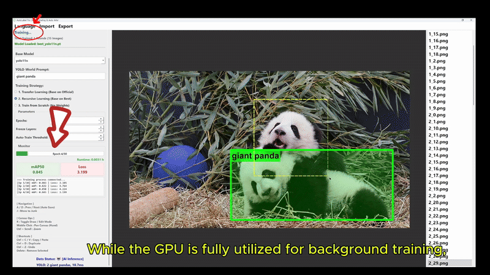
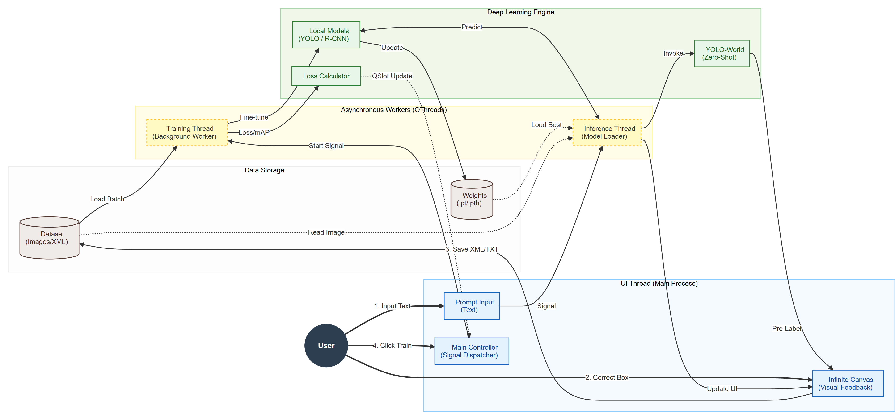

# KeenForge 2.0 — 你自己的数据集，你自己的「AI 工程师」

[](https://opensource.org/licenses/MIT)
[](https://www.python.org/)
[](https://pytorch.org/)
[](https://github.com/KeenForgeAI/KeenForge)
[](README.md)

> **CVPR 2026 Demo Track** · 前身 AutoLabel Pro

**KeenForge** 是一款本地优先的桌面软件，能把一个装满图片的文件夹，变成一个训练好的目标检测模型 —— 全程不写一行代码。导入图片，让它**自动去重、聚类**，你只标注少量「簇代表」，模型就在后台自我训练。**数据永远不出你的电脑。**

<p align="center">
  
</p>

---

## 2.0 新在哪

2.0 不是「更大的 1.0」，而是把「标完所有图」换成了**闭环主动学习**。

- 🧹 **智能数据清洗** — 三层去重（感知哈希 → 像素级 MAE → 旋转 / 镜像 / ±2px 平移对齐）+ 余弦聚类，自动挑出信息量最大的代表图。
- 🔁 **聚类引导的主动学习** — 只标注簇代表（通常每轮 **15–50 张**，不是几千张）→ 自动训练 → 模型比对 → **更细粒度重聚类** → 循环。每一轮，模型的薄弱区都会显现出来。
- 🔍 **模型比对模式** — 让训练好的模型去跑**已有标注**的图片。预测框显示为**青色虚线 + 置信度**，人工框保持绿色。**编辑即采纳** —— 未经确认的预测永远不会覆盖你的标注。
- ⚖️ **自选权重续训** — 从任意 `.pt` / `.pth` 接着训；内置迁移 / 递归 / 从零三种策略。
- ⚡ **非阻塞训练** — 训练跑在独立进程里，训练期间你照样能标注、聚类、复核。
- 📊 **训练总结** — 各类别标注框统计、逐轮 mAP、模型文件一览。
- 🌏 **中英双语界面** — 运行时随时切换。
- 🛡️ **鲁棒的读图** — 按文件内容识别格式，扩展名写错的图（`.png` 其实是 JPEG）也能正常打开。

---

## 工作原理（闭环）

```
      ┌──────────────────────────────────────────────────────────┐
      │                                                          │
  [聚类图片] → [标注簇代表] → [自动训练] → [比对并修正]
      ↑                                                          │
      └──────────── 重聚类（粒度递增） ←─────────────────────────┘
```

你标注的是**每簇的代表**，而不是整个数据集。模型训练后会预测下一批簇，你只需修正它做错的部分。这就是用**一小部分标注预算**换来一个小众领域强模型的方法。

<p align="center">
  
</p>

---

## 为什么选 KeenForge？

| | Roboflow | Label Studio | **KeenForge 2.0** |
|---|---|---|---|
| **部署** | 云端（数据要上传） | Docker（配置复杂） | **双击 exe** |
| **数据隐私** | ❌ 图片离开你的电脑 | ⚠️ 自托管但笨重 | ✅ **100% 本地离线** |
| **数据清洗** | 付费层 | ❌ 无 | ✅ **内置去重 + 聚类** |
| **主动学习** | ❌ 无 | ❌ 无 | ✅ **聚类引导闭环** |
| **AI 辅助** | 付费层 | 手动配置 | ✅ **YOLO-World 零样本** |
| **自动训练** | 付费 GPU 额度 | ❌ 无 | ✅ **簇代表配额达标即触发** |
| **模型归属** | ❌ 被平台锁死 | ✅ 开源 | ✅ **模型属于你** |
| **价格** | $79–$249/月 | 免费（自托管） | **免费开源** |

---

## 你能用它做什么？

- **工业质检**：检测产线上的划痕、凹坑、焊点缺陷
- **PCB / 材料**：检测公开模型根本不存在的表面缺陷
- **安全监控**：识别安全帽、反光衣、危险行为
- **科研**：为论文构建自定义数据集 —— 导出 COCO / VOC / YOLO
- **农业**：识别作物病害、无人机照片数牲畜
- **只要你看得见**：能画框的东西，KeenForge 就能学会找它

---

## 快速开始（3 分钟）

### 方式一：下载 EXE（Windows，推荐）

1. 到 [Releases](https://github.com/KeenForgeAI/KeenForge/releases) 下载最新的 `KeenForge` 构建
2. 双击启动
3. 加载你的图片文件夹
4. 在工具栏点**数据除重**和**相似分组**
5. 标注聚类代表 → 达到本轮配额后自动训练
6. 打开**模型比对**复核并修正预测 → 循环

### 方式二：从源码运行

```bash
# 1. 克隆
git clone https://github.com/KeenForgeAI/KeenForge.git
cd KeenForge

# 2. 安装依赖
pip install -r requirements.txt

# 3. 启动
python src/main.py
```

**环境要求**：Python 3.8+ · CUDA 可选（CPU 可跑，训练强烈建议 GPU）

---

## 核心功能

### 三层去重

1. **感知哈希**（PDQ）粗筛
2. **像素级 MAE** 复核（过滤「均匀背景导致的假重复」）
3. **几何匹配** —— 8 种二面体变换 + **±2px 平移对齐**

GC10-DET（2,306 张）实测：精确命中 **13 组真重复**，其中包含一对只差 2 像素平移的图（对齐后 MAE 10.14 → **2.57**）。

### 余弦聚类与代表选择

图片被向量化后聚类（hnswlib，余弦距离）。KeenForge 每簇选 1 个代表，覆盖约 80% 的数据，每轮代表数钳制在 **15–50** 张 —— 覆盖率驱动的配额，而不是死板的百分比。

### 零样本起步（YOLO-World）

输入任意物体名 —— `"焊接缺陷"`、`"安全帽"`、`"熟番茄"` —— 立刻找出目标，无需预训练。零样本召回有天花板（我们实测约 85–90%），第一轮训练就能突破。

### 模型库

| 模型 | 用途 |
|---|---|
| YOLOv8n/s/m/l/x | 通用目标检测 |
| YOLO11n/s/m/l/x | 最新 YOLO 架构 |
| RT-DETR-l/x | 实时 Transformer 检测 |
| YOLO-World v2 (s/m) | 零样本开放词表 |
| Faster-RCNN | 高精度、较慢 |
| RetinaNet | 密集目标场景 |
| SSD300 | 轻量、快速 |

### 格式支持

- **导入**：COCO JSON、Pascal VOC XML
- **导出**：COCO JSON、Pascal VOC XML、YOLO TXT
- **训练产物**：标准 Ultralytics `.pt` 权重

---

## 面向小众领域的数据集

目标检测在 COCO 上好演示，却在别处难落地。我们整理并发布了**修正版、开箱即用**的工业数据集 —— 去重、重划分、修格式：

**GC10-DET · NEU-DET · DeepPCB · PKU-Market-PCB · TXL-PBC · Raccoon**

→ [huggingface.co/KeenForgeAI](https://huggingface.co/KeenForgeAI) · 索引：[KeenForgeData](https://github.com/KeenForgeAI/KeenForgeData)

> 如果你下载了其中任一数据集，KeenForge 就是清洗它们所用的工具。

---

## 快捷键

| 按键 | 操作 |
|---|---|
| `A` / `D` | 上一张 / 下一张（自动保存） |
| `R` | 切换 绘制 / 编辑 模式 |
| `J` | 移入 Junk 文件夹 |
| `Ctrl+Z` | 撤销 |
| `Ctrl+C/V` | 复制 / 粘贴框 |
| `Ctrl+D` | 复制选中的框 |
| `Delete` | 删除选中的框 |
| `中键拖拽` | 平移画布 |
| `Ctrl + 滚轮` | 缩放 |

---

## 2.x 路线图

- [x] 数据集三层去重
- [x] 余弦聚类 + 代表选择
- [x] 聚类引导的主动学习闭环
- [x] 模型比对模式（编辑即采纳）
- [x] 自选权重续训
- [ ] SAM 分割（多边形掩码）
- [ ] 面向 YOLO 的自适应 finetune
- [ ] 一键 API 部署
- [ ] 支持 `pip install`

**想参与？** 去 [Issues](https://github.com/KeenForgeAI/KeenForge/issues) 找 `good first issue`。

---

## 参与贡献

欢迎贡献！

1. Fork 本仓库
2. 建分支：`git checkout -b feature/your-feature`
3. 提交你的改动
4. 推送并开 Pull Request

**尤其需要**：
- UI/UX 改进
- 新模型接入
- 文档翻译（中 ↔ 英）
- 用你自己的小众数据集来报 bug

---

## 引用

如果 KeenForge 对你有帮助，请引用：

```bibtex
@misc{keenforge2026,
  title={KeenForge: No-Code Desktop Tool for Expert-Led Object Detection Model Training},
  author={Lu Gan and Xi Li},
  year={2026},
  howpublished={\url{https://github.com/KeenForgeAI/KeenForge}},
  note={CVPR 2026 Demo Track}
}
```

---

## 许可证

MIT License — Copyright (c) 2026 KeenForgeAI. 开源与商用均免费。详见 [LICENSE](LICENSE)。

---

<p align="center">
  <b>⭐ 如果它帮到了你，请给个 Star！</b><br>
  <sub>由 <a href="https://github.com/KeenForgeAI">KeenForgeAI</a> 用 ❤️ 打造</sub>
</p>
